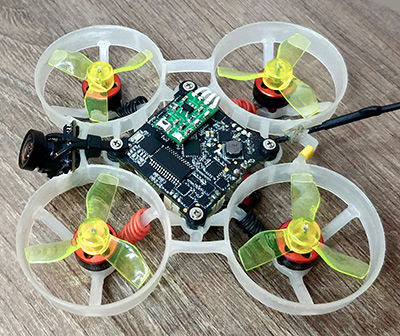

# Tiny Blackbox


Tiny Blackbox is an open source ultra-light external logger for micro drones.

* Size: 8 x 13 mm
* Weight: 0.32 g
* Logging rate: up to 8 kHz 
* Data rate: 1.5 Mbit/s
* Current consumption: < 30 mA
* Flash memory: 16 MB, W25Q128JVPIQ
* MCU: STM32G031G8U6



## Setup

1) Connect the device to any free UART port on your flight controller (RX->TX, TX->RX).
2) Setup blackbox in Betaflight Configurator:
* Ports tab: Peripherals -> Blackbox logging, speed 1500000.
* Modes tab: Blackbox -> assign to any available AUX switch.
* Blackbox tab: Logging device -> Serial Port.
<details>
<summary>Screenshots</summary>

</details>

## Operating modes

## Read recorded logs
1) Configure `bf_uart_number` number in `config.json` to match blackbox port number in Betaflight.
2) Connect the flight controller to PC.
3) Hold button for 1 second to switch into Read mode (double blinks).
4) Run Python script `tinybb.py`.  The script automatically turns your flight controller into _Serial Passthrough_ mode. 
5) Save logs from flash to file with `r` command.
6) Open file with Blackbox Explorer and enjoy :-)

You may need to install `pySerial` module before running the script. Type `pip3 install pyserial` in command prompt (cmd.exe or Terminal).

<details>
<summary>Example of CLI output:</summary>
  
```
Open /dev/cu.usbmodemFA131 successfully

===== Betafligh CLI mode =====
>> Entering CLI Mode, type 'exit' to return, or 'help'
>> # serialpassthrough 1 500000
>> Port1: 1
>> Port2: 20
>> Port1 opened, baud = 500000.
>> Forwarding, power cycle to exit.
==============================

Flash memory: 38.0% full

i - Information
r - Read memory
d - Dump full memory
e - Erase
x - Exit

Enter command: 
> r

Downloading:
Press ctrl+c to stop
................ 1 Mb
................ 2 Mb
................ 3 Mb
................ 4 Mb
................ 5 Mb
................ 6 Mb
.
6391040 bytes received
Blackbox_Log_20210213_112830.bbl saved
> 
```
</details>

## For developers and enthusiasts

* Build firmware using [STM32CubeIDE](https://www.st.com/en/development-tools/stm32cubeide.html)
* Flash pre-built HEX-firmware with [STM32CubeProg](https://www.st.com/content/st_com/en/products/development-tools/software-development-tools/stm32-software-development-tools/stm32-programmers/stm32cubeprog.html) or [STLink](https://github.com/stlink-org/stlink) toolset.
* Connect ST-Link programmer to following pins:


## Contacts

Feel free to contact me in Telegram: [@AlexeyStn](https://t.me/AlexeyStn)
