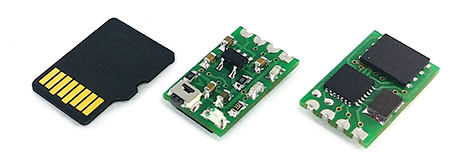
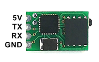

# Tiny Blackbox

Tiny Blackbox for Micro Drones as small as a microSD card.

* Size: 9 x 14 mm
* Weight: 0.47 g
* Data rate: 1.5 MBit/s
* Flash memory: 16 MB

Based on STM32F042 mcu and W25Q128 flash memory.

