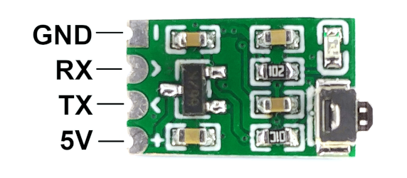
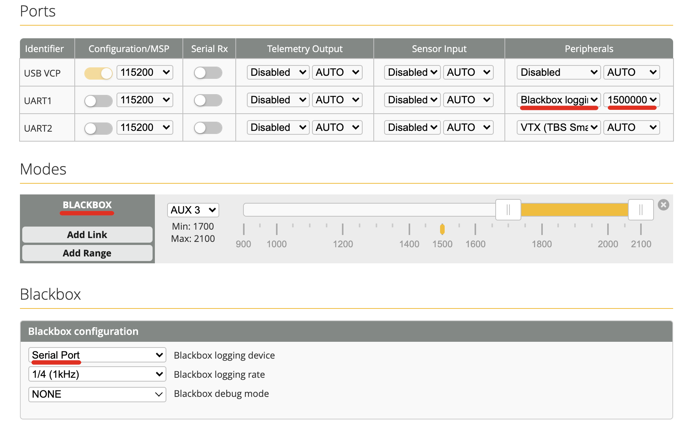
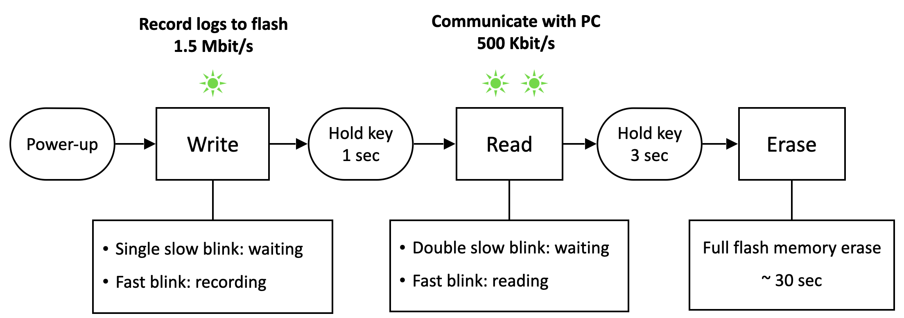
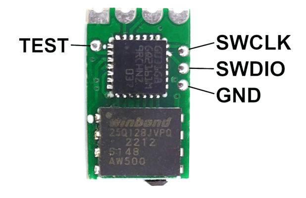

# Tiny Blackbox

Tiny Blackbox - open source ultra-light external logger for micro drones. 

* Size: 8 x 13 mm
* Weight: 0.32 g
* Logging rate: up to 8 kHz 
* Data rate: 1.5 Mbit/s
* Current consumption: < 30 mA
* Flash memory: 16 MB, W25Q128JVPIQ  
 &gt; 3 min at 4 kHz, full log  
 &gt; 45 min at 1 kHz, gyro-only log (all other fields disabled)
* MCU: STM32G031G8U6

For previous version with F042 chip go to [this page](https://github.com/alexeystn/tiny-blackbox/tree/stm32f042)

## Setup

1) Connect the device to any free UART port on your flight controller (RX->TX, TX->RX). 
Signal wires must be tightly twisted to prevent interference.

2) Setup blackbox in Betaflight Configurator:
* Ports tab: Peripherals -> Blackbox logging, speed 1500000.
* Modes tab: Blackbox -> assign to any available AUX switch.
* Blackbox tab: Logging device -> Serial Port.

<b>Screenshots</b>

## Operating modes

## Read recorded logs
1) Download application on [Releases](https://github.com/alexeystn/tiny-blackbox/releases) page: "exe" for Windows, "app" for macOS.
2) Connect flight controller to PC.
3) Hold hardware button for 1 second to switch into Read mode (double blinks).
4) Open application, configure connection parameters and press "Connect".
5) Save logs to file and open them with Betaflight Blackbox Explorer.

Also, you can connect Logger directly to PC with FTDI/CP2102 adapter, without flight controller.  
Select "Serial-USB adapter" instead of "Betaflight passthrough".

<b>Optional: Run the source code</b>

 
If you face some difficulties running exe/app, you can run GUI source code:

1) Get the latest version of [Python](https://www.python.org/downloads/).  
Set "Add Python to PATH" checkbox while installing.
2) Install additional modules.  
Open "cmd.exe" (Windows) or "Terminal" (macOS) and enter:  
`pip3 install pyserial`  
`pip3 install PyQt5==5.15`
3) Download and run GUI Python script: [tinybb_gui.py](/Software/GUI/tinybb_gui.py).

<b>Optional: Command line interface</b>

CLI Python script for downloading logs is also available. 
Install Python and `pyserial` as described in section above. 
Run CLI script: [tinybb_cli.py](/Software/CLI/tinybb_cli.py)

## For developers and enthusiasts

* Use [EasyEDA](https://easyeda.com/editor) online editor to modify the board.
* PCB thickness 0.6 mm is optimum for weight/reliability.
* X5R/X7R capacitors are recommended.
* Edit and build firmware using [STM32CubeIDE](https://www.st.com/en/development-tools/stm32cubeide.html).
* Flash pre-built [HEX-firmware](/Firmware/Debug/Blackbox.hex) with [STM32CubeProgrammer](https://www.st.com/content/st_com/en/products/development-tools/software-development-tools/stm32-software-development-tools/stm32-programmers/stm32cubeprog.html) or [STLink](https://github.com/stlink-org/stlink) toolset.  
Use following commands to flash with STLink tool: 
`st-flash erase` 
`st-flash --format ihex write "Blackbox.hex"` 
`st-flash reset`
* Connect ST-Link programmer to SWDIO and SWCLK pins:

## Contacts
 
Feel free to contact me in Telegram: [@AlexeyStn](https://t.me/AlexeyStn)
